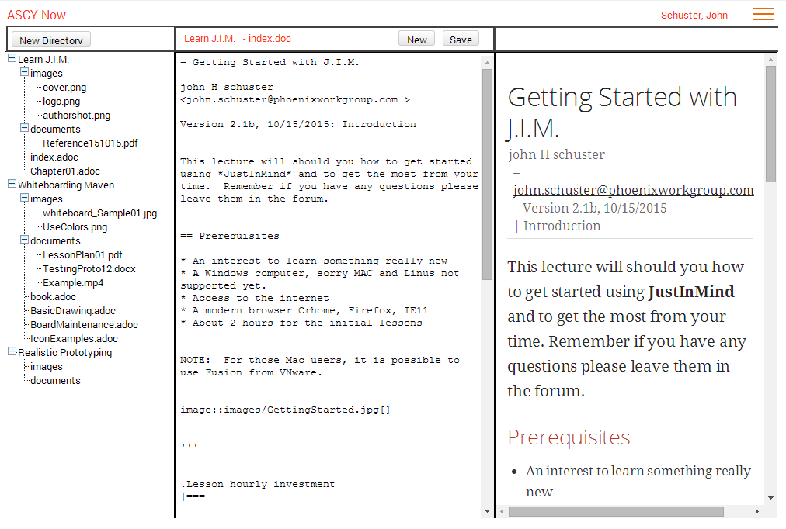

= ASCY-Now ASCIIDoctor Web Editor
John Schuster <john.schuster@phoenixworkgroup.com>
Ver 2.2, 10/29/2015: Phoenix Learning Labs

// for keyboard key rendering
:experimental:

The ASCY-Now application offers instructional designers who have mastered ASCIIDoctor markdown language a straightforward tool for courseware development. ASCY-Now is geared toward educators rather than technical users, and is modeled loosely after the ASCIIDoctor FX Windows client tool (http://asciidocfx.com/).

The application can be written in Ruby programming language (preferred) or PHP, runs on a LAMP stack hosted by a Bluehost server, and requires a stateless protocol. The interface welcomes user recommendations and suggestions focused on the instructional audience.

ASCY-Now is intended to simplify creation, maintenance, and deployment of web-based instructional materials.  To protect from inadvertent usage, ASCY-Now enforces basic rules such as ensuring document files have an ADOC extension, and ensuring image files have a PNG, JPG, or GIF extension.

Files and directories comprising the courseware material reside on a Linux server. In an attempt to avoid scattering multiple copies of the materials across multiple servers, upon saving the ADOC file an HTML file generates automatically on the Linux server.

:toc:

== Minimum Viable Product (MVP)

The Minimum Viable Product (MVP) described here illustrates the least effort needed to obtain a simple-function web authoring tool. Future intent is to provide rapid application updates, each with a small number of traceable features.

ASCIIDoctor FX

ASCIIDoctor FX is an great Windows-based tool for ASCIIDoctor document creation, but lacks in a few crucial areas.

Critical ASCIIDoctor FX detriments include:
* It is a Windows/Mac/Linux client; a web-based platform is preferred
* It is written in Java which poses installation problems for some instructors
* It does not offer the means to restrict usage/avoid novice user mistakes
* Incorrect file extensions can easily be created
* Files can be written to incorrect directories
* Files can be incorrectly named with special characters, spaces, or capital letters
* Allows naming the generated file something different from the authored file
* It does not provide a simple way to implement a strict directory/file structure to match the courseware development process
* It does not automatically generate HTML files from the ADOC files, causing sync issues
* It does not provide an intuitive means to transfer files to the distribution server
* The file tree viewing pane does not allow multiple directories to be viewed simultaneously, making it difficult for instructors to copy material between courses
* It is a work in progress and continues to have growing pains, which translates into application failures at inappropriate times
* It does not have a spelling checker

Installation Environment

The ASCY-Now installation environment is a Blue host server able to host either Ruby or PHP applications. Future iterations of ASCY-Now will include a SQLite database to hold backups, snippets, and security access. Please note, the MVP version will not contain any database features.

ASCY-Now works directly with the file system on the Bluehost server; this should eliminate the need to sync local PC copies with the server. Two major directories comprise ASCY-Now:

* ASCYNow – Web application directory
* Courses – Content directory (can further define within the application)

Content Available Openly

The ASCY-Now application can be installed in multiple directories on the same server; this allows users/user groups to be isolated to a specific area. The content directory is accessible openly on the internet via a standard URL such as http://pwc-lms.com/Courses/ASCY-Now-MVP.

Web Site Directory Structure

image::images/WebSite_Directory_Structure.png[]

Wireframe

The ASCY-Now wireframe contains three panes, similar to ASCIIDoctor FX. However, only a single ADOC file can be edited at a time. Please note, the tabbed multiple editing panes may be added in a future iteration.

* Directory/File pane
* Editing pane
* Viewing pane

Directory/File Pane

The Directory/File pane displays actual Linux server File system files for the START directory (as indicated in the setup). In this instance, the START directory is titled ‘Courses’. Users need standard file system management capabilities for any directory or file housed in the START directory.

File Management Functions

File management functions are accessed through right-click functionality.

* Rename a directory
* Delete a directory (with confirmation)
* Create a directory within an existing directory
* Rename a file (without renaming extension)
* Delete a file (with confirmation)

NOTE: Creating a new first tier directory (directly under the START directory) is accomplished using the New Directory button located in the Directory/File pane header.

Editing Pane

The Editing pane presents the ADOC file currently being edited; in the header, the directory name and ADOC file name provide confirmation. The Editing pane includes word-wrap functionality, eliminating the need for left-right scrolling. The HTML viewing pane simultaneously updates as edits occur in the Editing pane.

Saving ADOC Files

Click the Save button or press the Ctrl+S keyboard keys to save the ADOC file. ASCY-Now automatically generates the HTML file, using the same naming convention as the ADOC file with an HTML extension instead. The ADOC to HTML conversion uses the ASCIIDoctor.JS library.

Copy and Paste ADOC File Content

Standard Copy-Paste keyboard functionality works. The user can:
* Press Ctrl+C to copy
* Press Ctrl+V to paste
* Press Ctrl+X to cut

New ADOC Files

New ADOC files are created using the New button in the Editing pane header. A dialog box displays, prompting the user to name the new file. The file extension always defaults to ADOC; therefore, avoid entering ‘ADOC’ in the file name. If including ‘ADOC’, the file will be named NewFile.ADOC.ADOC.

Viewing Pane

The Viewing pane displays the current HTML version of the ADOC file, with the HTML content wrapped; no left-right scrolling is permitted. However, as the user scrolls vertically within the Viewing pane the Editing pane moves in sync.

Images

Images are a significant part of the document-creation process. The ability to insert an image into an ADOC file must be intuitive and simple.

Some instructors save their image content as files on their local computer. Other instructors capture images which are saved to the clipboard as they work. ASCY-Now accommodates both styles of instructional content building.

Drag and Drop

Instructors have the ability to drag an image file from their desktop into an ADOC file. The image generates in the Editing pane’s current cursor position. The user:
* Confirms the file being dragged contains an appropriate image file extension (e.g., PNG, JPG, GIF)
* Uploads the file into the current directory’s Images sub-directory
* Confirms intent to overwrite any image

Copy and Paste

Instructors have the ability to copy an image from another application such as SnagIt to a clipboard. The image generates in the Editing pane’s current cursor position. The user:
* Confirms the file copied to the clipboard contains an appropriate image file extension (e.g., PNG, JPG, GIF)
* Names the image file using the naming convention ‘snapshotxxxx.yyy’, where xxxx is the next sequential number, and yyy is the copied image file’s extension
* Uploads the file into the current directory’s Images sub-directory
* Confirms intent to overwrite any image

Post MVP Versions

When the first brainstorming session was held for this web-based authoring utility, over 100 features were drafted. Some features were considered important and others were not. The backlog features will be prioritized for future updates by a committee of the instructors.

== Author, Author

John Schuster, Technical Evangelist, Phoenix Learning Labs.

I love to preach the benefits and evils of new technologies to everyone.  Well, at least those who will listen.

Some of these technologies include Learning Systems, Databases/Data Warehouses, Business Intelligence/Analytics, Web Design/Prototyping, and Virtual Systems.
